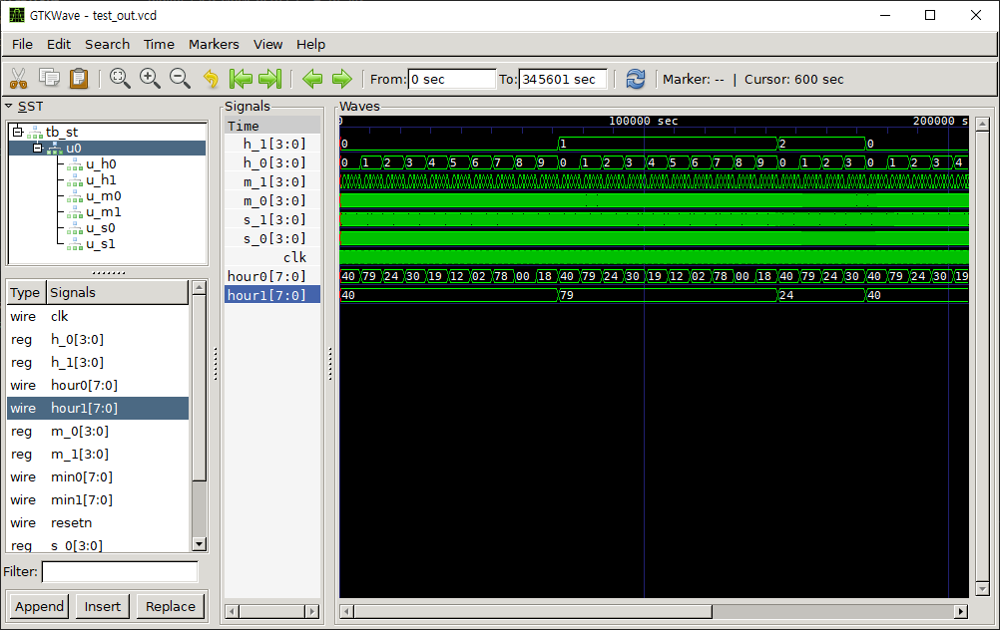

# verilog digital clock
# 베릴로그 디지털 시계 

오늘 숨고로 디지털 시계 만드는걸 도와달라는 요청이 왔는데 

이런걸 말하는건가 싶어서 만들어봄...

---

## Preparations(준비사항)


install icarusVerilog or other simulator  
icarusVerilog 혹은 다른 시뮬레이터를 사용하세요

icarusVerilog Download : http://bleyer.org/icarus/  
icarusVerilog 사용법 : https://blog.naver.com/doksg/221699215846

7-seg의 경우 인터넷에 DE2 board로 하는게 있던데 거기에 LOW_ACTIVE 기준으로 작성된게 있어서 참고하여 값을 결정하였음

---

## how to execute(어떻게 실행하나)

```
iverilog -o out.vvp VERILOG_CODE
vvp out.vvp
gtkwave WAVE_FORM_FILE_NAME
```

digital_7seg_clock_better 폴더에 있는걸 실행시킨다고하면

```
iverilog -o out.vvp tb_st.v seven_seg_mux.v seven_seg_tiemr.v
vvp out.vvp
gtkwave test_out.vcd
```

